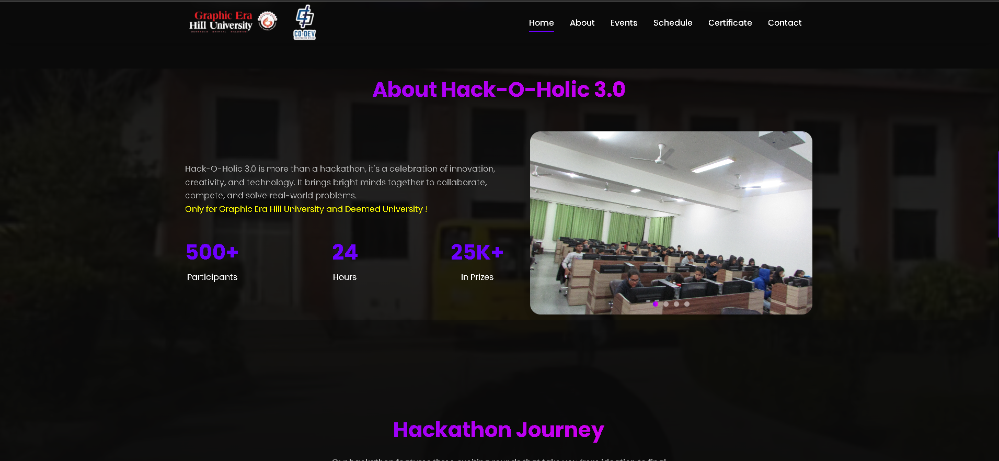
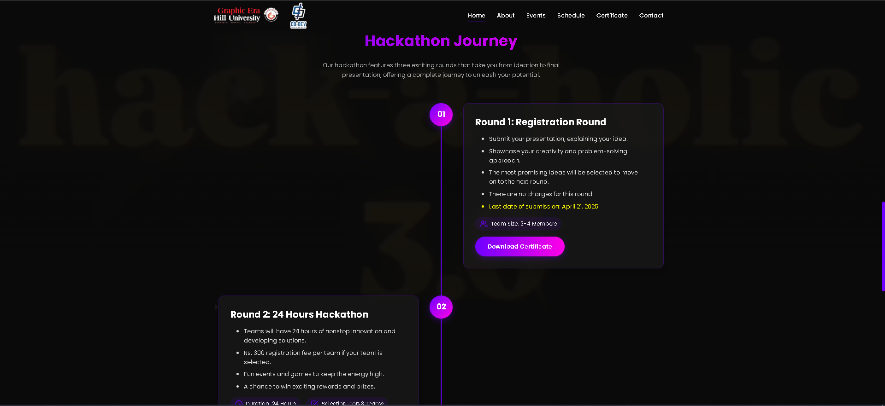
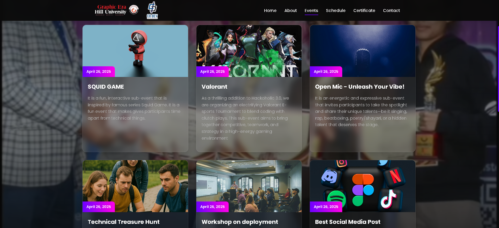
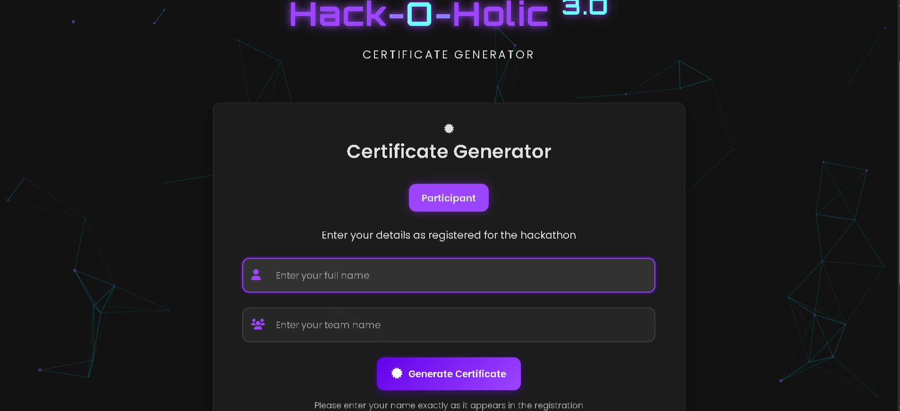

# ⚙️ Hack-O-Holic 3.0 - Hackathon Website  
[](https://opensource.org/licenses/MIT)  [](https://reactjs.org)  [](https://nodejs.org)  [](https://mongodb.com)  [](https://opensource.org/licenses/MIT)


---

## 📌 Overview  

**Hack-O-Holic 3.0** is a modern full-stack hackathon platform built using the MERN stack.  
It’s used to manage registrations, showcase events, and provide participants with live schedules and communication.  

🚀 **2000+ registrations**  
📜 **100+ teams awarded with certificates**  
🕒 **Live timeline and event schedule built into the website**

---

## 📽️ UI Preview  

|  |  |
|-------------------|-------------------|
|  |  |


## 🚀 Features  

- 🖥️ Fully responsive layout  
- 🎥 Background video loop support  
- 📅 Event timeline with Framer Motion animations  
- ✍️ Multi-step registration with form validation  
- 📧 Contact form via EmailJS   
- 📜 Certificate-ready system  

---

## Pages

1. **Home Page**: Overview of the hackathon with key information
2. **About Page**: Detailed information about the hackathon, its history, and the organizing team
3. **Schedule Page**: Detailed timeline of the hackathon events
4. **Register Page**: Multi-step registration form for participants
5. **Contact Page**: Contact form and information

## Technologies Used

### Frontend
- React.js
- React Router for navigation
- Styled Components for styling
- Framer Motion for animations
- React Intersection Observer for scroll animations

### Backend (Setup Ready)
- Node.js
- Express.js
- MongoDB (Schema ready)

## Project Structure

```
Hackathon/
├── client/                  # Frontend React application
│   ├── public/              # Public assets
│   │   ├── videos/          # Background videos
│   │   ├── images/          # Images for the website
│   │   └── index.html       # HTML template
│   └── src/                 # React source code
│       ├── components/      # Reusable components
│       ├── pages/           # Page components
│       ├── App.js           # Main App component
│       └── index.js         # Entry point
├── server/                  # Backend Node.js/Express application
│   ├── controllers/         # Request controllers
│   ├── models/              # MongoDB models
│   └── routes/              # API routes
└── README.md                # Project documentation
```

## Setup Instructions

### Prerequisites
- Node.js and npm installed
- MongoDB installed (for backend functionality)

### Installation

1. Clone the repository:
```
git clone <repository-url>
```

2. Install frontend dependencies:
```
cd Hackathon/client
npm install
```

3. Install backend dependencies:
```
cd ../server
npm install
```

4. Create a `.env` file in the server directory with the following variables:
```
PORT=5000
MONGODB_URI=mongodb://localhost:27017/hackathon
JWT_SECRET=your_jwt_secret
```

5. Start the frontend development server:
```
cd ../client
npm start
```

6. Start the backend server:
```
cd ../server
npm start
```

7. Open your browser and navigate to `http://localhost:3000`

## Adding Your Own Background Videos

1. Place your video files in the `client/public/videos/` directory
2. Update the `videoSources` array in the `VideoBackground.js` component to include your video file paths

## Customization

- Colors and theme: Edit the color variables in the styled components
- Content: Update the text and images in each component to match your hackathon details
- Logo: Replace the logo in the Navbar component

## License

This project is licensed under the MIT License - see the LICENSE file for details.

## Acknowledgments

- Designed and developed for the Hack-O-Holic 3.0 Hackathon Technical Committee
- Built with React.js and Node.js
